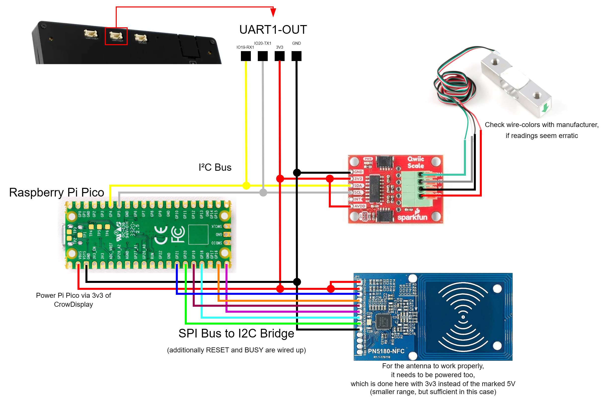

# Wiring Guide

Detailed wiring diagrams and pin connections for all SpoolBuddy components.

---

## System Architecture

SpoolBuddy uses two microcontrollers:

- **CrowPanel (ESP32-S3)** - Display, UI, and scale (NAU7802)
- **Raspberry Pi Pico** - NFC reader (PN5180)

```
┌─────────────────┐      ┌─────────────────┐      ┌─────────────────┐
│   CrowPanel     │      │  Raspberry Pi   │      │    PN5180       │
│   ESP32-S3      │      │     Pico        │─SPI──│    NFC          │
│                 │      │                 │      │                 │
│   UART1-OUT ────┼──I2C─│                 │      └─────────────────┘
└────────┬────────┘      └─────────────────┘
         │ I2C
    ┌────┴────┐
    │ NAU7802 │
    │  Scale  │
    └────┬────┘
         │
    ┌────┴────┐
    │Load Cell│
    └─────────┘
```

---

## Safety First

- :material-power-plug-off: **Always disconnect power** before making wiring changes
- :material-flash-alert: Use **3.3V only** for the PN5180 (5V will damage it!)
- :material-check-all: Double-check connections before powering on

---

## Wiring Diagram



---

## NAU7802 Scale → CrowPanel (I2C)

The scale ADC connects to the CrowPanel's **UART1-OUT** header.

### UART1-OUT Header Pinout

```
┌──────┬──────┬──────┬──────┐
│ Pin1 │ Pin2 │ Pin3 │ Pin4 │
│IO19  │IO20  │ 3V3  │ GND  │
│ SDA  │ SCL  │ VCC  │ GND  │
└──────┴──────┴──────┴──────┘
```

### NAU7802 Connections

| NAU7802 Pin | CrowPanel | Header | Wire Color |
|-------------|-----------|--------|------------|
| SDA | IO19 | UART1-OUT Pin 1 | Yellow |
| SCL | IO20 | UART1-OUT Pin 2 | White |
| VCC | 3.3V | UART1-OUT Pin 3 | Red |
| GND | GND | UART1-OUT Pin 4 | Black |

---

## Load Cell → NAU7802

Connect the 4-wire load cell to the screw terminals on the NAU7802 board.

```
   Load Cell (5kg)                SparkFun Qwiic Scale
  ┌─────────────────┐            ┌─────────────────┐
  │  Red ───────────┼────────────┤► E+ (Red)       │
  │  Black ─────────┼────────────┤► E- (Black)     │
  │  White ─────────┼────────────┤► A- (White)     │
  │  Green ─────────┼────────────┤► A+ (Green)     │
  └─────────────────┘            └─────────────────┘
```

| Load Cell Wire | NAU7802 Terminal | Function |
|----------------|------------------|----------|
| Red | E+ | Excitation + |
| Black | E- | Excitation - |
| White | A- | Signal - |
| Green | A+ | Signal + |

!!! info "Wire Colors Vary"
    Wire colors vary by manufacturer. If readings are negative or erratic, try swapping A+ and A-.

---

## PN5180 NFC → Raspberry Pi Pico (SPI)

The NFC reader connects to the Raspberry Pi Pico via SPI.

### Pico Pinout Reference

```
                    Raspberry Pi Pico
                  ┌───────────────────┐
            GP0  ─┤ 1              40 ├─ VBUS
            GP1  ─┤ 2              39 ├─ VSYS
            GND  ─┤ 3              38 ├─ GND
            GP2  ─┤ 4              37 ├─ 3V3_EN
            GP3  ─┤ 5              36 ├─ 3V3 (OUT)
            GP4  ─┤ 6              35 ├─ ADC_VREF
            GP5  ─┤ 7              34 ├─ GP28
            GND  ─┤ 8              33 ├─ GND
            GP6  ─┤ 9              32 ├─ GP27
            GP7  ─┤ 10             31 ├─ GP26
            GP8  ─┤ 11             30 ├─ RUN
            GP9  ─┤ 12             29 ├─ GP22
            GND  ─┤ 13             28 ├─ GND
           GP10  ─┤ 14             27 ├─ GP21 ← RST (RESET)
           GP11  ─┤ 15             26 ├─ GP20 ← BUSY
           GP12  ─┤ 16             25 ├─ GP19 ← SCK
           GP13  ─┤ 17             24 ├─ GP18 ← MOSI
            GND  ─┤ 18             23 ├─ GND
           GP14  ─┤ 19             22 ├─ GP17 ← NSS (CS)
           GP15  ─┤ 20             21 ├─ GP16 ← MISO
                  └───────────────────┘
```

### PN5180 Connections

| PN5180 Pin | Pico GPIO | Pico Pin # | Wire Color |
|------------|-----------|------------|------------|
| VCC | 3V3 | 36 | Red |
| GND | GND | 33 or 38 | Black |
| SCK | GP19 | 25 | Yellow |
| MISO | GP16 | 21 | Orange |
| MOSI | GP18 | 24 | Green |
| NSS (CS) | GP17 | 22 | Blue |
| BUSY | GP20 | 26 | Pink |
| RST | GP21 | 27 | Brown |

!!! danger "3.3V Only!"
    The PN5180 is 3.3V only. Do NOT connect to 5V (VBUS) - it will damage the chip!

---

## Quick Reference Card

```
┌────────────────────────────────────────────────────────────┐
│              SPOOLBUDDY QUICK WIRING REFERENCE             │
├────────────────────────────────────────────────────────────┤
│                                                            │
│  NAU7802 (Scale) → CrowPanel UART1-OUT                     │
│  ─────────────────────────────────────                     │
│  SDA  → Pin 1 (IO19)    VCC → Pin 3 (3V3)                  │
│  SCL  → Pin 2 (IO20)    GND → Pin 4 (GND)                  │
│                                                            │
│  Load Cell → NAU7802 Terminals                             │
│  ─────────────────────────────                             │
│  Red → E+    Black → E-    White → A-    Green → A+        │
│                                                            │
│  PN5180 (NFC) → Raspberry Pi Pico                          │
│  ────────────────────────────────                          │
│  MISO → GP16 (Pin 21)       SCK  → GP19 (Pin 25)           │
│  MOSI → GP18 (Pin 24)       NSS  → GP17 (Pin 22)           │
│  BUSY → GP20 (Pin 26)       RST  → GP21 (Pin 27)           │
│                                                            │
│  PN5180 (NFC) → CrowPanel UART1-OUT                        │
│  ────────────────────────────────                          │
│  VCC  → Pin 3 (3V3)        GND  → Pin 4 (GND)              │
│  5V   → Pin3 (3V3) (not redundant, enables antenna)        │
│                                                            │
│  Raspberry Pi Pico → CrowPanel UART1-OUT                   │
│  ────────────────────────────────                          │
│  VSYS (Pin 39) → Pin3 (3V3)   GP4  → Pin 1 (IO19)          │
│  GND  (Pin 38) → Pin4 (GND)  GP5  → Pin 2 (IO20)           │
│                                                            │
│  Power                                                     │
│  ─────                                                     │
│  CrowPanel: USB-C 5V/2A                                    │
│                                                            │
│  Pico: powered from I2C                                    │
│  (powering via USB is possible for debug purposes,         │
│  but connection to VSYS (Pin 39) should be swapped to      │
│  3V3_EN (Pin37) when using it to prevent the USB-5V        │
│  from seeping into the system)                             │
└────────────────────────────────────────────────────────────┘
```

---

## Power Requirements

| Component | Voltage | Current (typical) |
|-----------|---------|-------------------|
| CrowPanel 7.0" | 5V (USB-C) | 300-600mA |
| Raspberry Pi Pico | 5V (USB) or 3.3V | 25-100mA |
| PN5180 | 3.3V | 80-150mA |
| NAU7802 | 3.3V | 1-2mA |

!!! success "Recommendation"
    Use quality USB-C cables and a 5V/2A power adapter for the CrowPanel.

---

## Wiring Checklist

### NAU7802 → CrowPanel

- [ ] SDA → UART1-OUT Pin 1 (IO19)
- [ ] SCL → UART1-OUT Pin 2 (IO20)
- [ ] VCC → UART1-OUT Pin 3 (3V3)
- [ ] GND → UART1-OUT Pin 4 (GND)

### Load Cell → NAU7802

- [ ] Red wire → E+ terminal
- [ ] Black wire → E- terminal
- [ ] White wire → A- terminal
- [ ] Green wire → A+ terminal

### PN5180 → Pico

- [ ] SCK → GP19 (Pin 25)
- [ ] MISO → GP16 (Pin 21)
- [ ] MOSI → GP18 (Pin 24)
- [ ] NSS → GP17 (Pin 22)
- [ ] BUSY → GP20 (Pin 26)
- [ ] RST → GP21 (Pin 27)

### PN5180 → CrowPanel

- [ ] VCC → UART1-OUT Pin 3 (3V3)
- [ ] 5V → UART1-OUT Pin 3 (3V3)
- [ ] GND → UART1-OUT Pin 4 (GND)

### Pico → CrowPanel
- [ ] VSYS (Pin 39) → UART1-OUT Pin 3 (3V3)  
- [ ] GND  (Pin 38) → UART1-OUT Pin 4 (GND)

!!! danger "USB-powered Pico"
    If you wish to connect the Pico to USB-power (e.g. for debugging purposes), connect **UART-OUT Pin3 (3V3)** to **3V3_EN (Pin37)** to prevent 5V power to seep into the 3.3V power distribution.

---

[Next: Assembly Guide :material-arrow-right:](assembly.md){ .btn .btn-primary }
